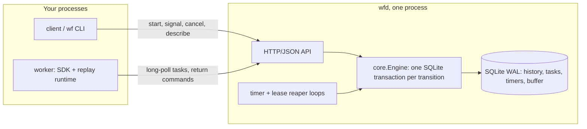

# ♻️ workflow-engine

> Durable workflow engine. Workflows as plain Go code, event-sourced in SQLite, replayed after any crash.

**0 lost workflows and 0 double-applied side effects across 200 `kill -9`s (54 of the server) over 500 workflows; 9 activity re-executions were absorbed by idempotency keys. With the keys disabled, the same seed double-applied 22. 703 transitions/s on SQLite (WAL, synchronous=FULL, database on tmpfs), p99 81.7 ms per transition.**

<!-- readme-header -->
[](https://github.com/sathwikbairaboina2/workflow-engine/actions/workflows/ci.yml)   

| Measured | Source |
|---|---|
| **0 lost / 200 kill -9** | `bench/results/` |
| **703 transitions/s** | `bench/results/` |

A small durable workflow engine in Go. You write a workflow as ordinary Go code; the server stores an
event-sourced history in SQLite, and workers rebuild the workflow's state by replaying that history, so a
`kill -9` of any process loses nothing.

Read the throughput figure with its conditions: it was measured with the database on tmpfs, where `fsync` is nearly
free, so it is the engine's ceiling. On this machine's Docker Desktop disk the same engine did 10
transitions/s with a p50 of 199 ms per transition, because every commit waits for a real `fsync` (see
[Benchmark](#benchmark)). `kill -9` does not lose the kernel page cache, so the chaos soak proves the same
thing on either filesystem. The two chaos runs use the same seed, so the same kills are scheduled, but what
each kill interrupts depends on timing: re-execution counts differ between runs (9 and 22).

The report that the first number comes from (`bench/results/chaos-latest.json`, printed by `scripts/chaos.sh`):

```
workflow-engine chaos report (seed 42)
  workflows started        500
  kill -9 injected         200  (server 54, workers 146)
  lost workflows           0
  double-applied effects   0
  activity re-executions   9  (absorbed by idempotency keys)
  replay failures          0
  consistency violations   0
  server recovery p50      23 ms  (max 82 ms)
  result                   PASS
```

## Try it in 30 seconds

Everything runs in Docker; the host needs no Go. From Git Bash:

```sh
sh scripts/demo.sh                                    # wfd + 2 workers, 5 transfers, one worker kill -9'd mid-flight
sh scripts/chaos.sh --workflows 100 --kills 50 --seed 1   # the chaos report above, smaller
```

`demo.sh` publishes `wfd` on host port 5400 and ends by printing the history of `demo-1`. Tear down with
`docker compose -f deploy/docker-compose.yml down -v`.

## Install

Go 1.26+ for the SDK and binaries, or build the image with Docker:

```sh
go get github.com/sathwikbairaboina2/workflow-engine/sdk/...
go install github.com/sathwikbairaboina2/workflow-engine/cmd/wf@latest
go install github.com/sathwikbairaboina2/workflow-engine/cmd/wfd@latest
docker build -t workflow-engine:dev .
```

## What a workflow looks like

This is the example in `examples/transfer`. The workflow is deterministic code; everything that touches the
world (the ledger writes) is an activity, and the receipt id is recorded once with `SideEffect`.

```go
func Transfer(ctx workflow.Context, in Input) (string, error) {
	if err := workflow.ExecuteActivity(ctx, activityOptions, "Debit", Leg{Account: in.From, AmountCents: in.AmountCents}).Get(ctx, nil); err != nil {
		return "", err
	}
	if err := workflow.Sleep(ctx, 200*time.Millisecond); err != nil {
		return "", err
	}
	if err := workflow.ExecuteActivity(ctx, activityOptions, "Credit", Leg{Account: in.To, AmountCents: in.AmountCents}).Get(ctx, nil); err != nil {
		return "", err
	}
	var receipt string
	if err := workflow.SideEffect(ctx, func() any {
		var b [16]byte
		_, _ = rand.Read(b[:])
		return hex.EncodeToString(b[:])
	}).Get(&receipt); err != nil {
		return "", err
	}
	return receipt, nil
}
```

The ledger honours `activity.GetInfo(ctx).IdempotencyKey`, which is the same on every retry of one scheduled
activity, so an activity that runs twice writes once. `go run ./cmd/wfcheck ./...` flags `time.Now`, `time.Sleep`,
`math/rand`, `go` and `select` inside workflow functions.

## Configuration

`wfd` takes flags, not env vars: `-listen` (default `:7233`), `-db` (default `wf.db`), `-wft-timeout`, `-poll-timeout`,
`-timer-interval`, `-reaper-interval`, `-max-history-events` (default 50000) and `-max-payload-bytes` (default 2 MiB).
The `wf` CLI talks to `WF_SERVER` or `--server` (default `http://localhost:5400`, the port the Docker compose file
publishes; `WF_PORT` changes it).

## Architecture



A worker receives a workflow task together with the full history, replays it through a deterministic
coroutine runtime, and returns commands. The server validates the commands against history and appends
events; nothing outside the history decides state.

## Guarantees

The precise list is in [docs/semantics.md](docs/semantics.md), including what is not guaranteed.

- History is append-only and dense per run (triggers abort `UPDATE` and `DELETE`); concurrent completions of one task apply once.
- While a workflow task is in flight, signals, timers and activity results are buffered and appended behind its commands.
- Workflow code that diverges from recorded history fails the task with `nondeterminism` and appends no commands.
- A timer fires exactly once and never early; a stale or foreign lease token changes nothing.
- Activities are at-least-once; idempotency keys make their effects effectively-once.

## Benchmark

`sh scripts/bench.sh` runs the server and an SDK worker in one container over real HTTP and a real SQLite file
(`synchronous=FULL`): 2000 workflows of one workflow task, one activity and one more task, 6 transitions each.
Four runs of the same command gave 708, 719, 681 and 703 transitions/s (the last is the file below).

| | tmpfs (`bench-latest.json`) | container disk (`bench-disk.json`) |
|---|---|---|
| Workflows run | 2000 | 150 |
| Workflows per second | 117 | 1.7 |
| Transitions per second | 703 | 10.0 |
| Transition latency p50 / p99 | 8.4 ms / 81.7 ms | 199 ms / 2584 ms |
| Workflow end-to-end p50 / p99 | 13953 ms / 15177 ms | 75124 ms / 79980 ms |

Transition latency includes the wait for the single writer slot, so it grows with load; end-to-end latency is
dominated by the 64 concurrent starters queuing all 2000 workflows at once. Machine: Docker Desktop on Windows 11,
24 CPUs, Go 1.26.8, server, workers and load generator in one container. The disk column used
`WF_TMPFS=0 sh scripts/bench.sh --workflows 150 --concurrency 16`; a synchronous 4 KiB write took about 160 ms on
that disk, which is the whole story of the gap.

## Layout

| Path | What |
|---|---|
| `cmd/wfd` | the server |
| `cmd/wf` | CLI: start, describe, history, signal, cancel, result, health |
| `cmd/wfcheck` | determinism linter for workflow code |
| `cmd/chaos`, `chaos/` | the kill -9 harness and its invariant checks |
| `cmd/wfbench`, `internal/bench/` | the benchmark |
| `wire/` | public wire types: events, commands, payloads, API bodies |
| `internal/store` | SQLite schema, transactions, failpoints, consistency checker |
| `internal/core` | the engine: tasks, leases, timers, buffering, retries |
| `internal/api`, `internal/metrics` | HTTP API and Prometheus metrics |
| `sdk/client`, `sdk/worker`, `sdk/workflow`, `sdk/activity` | the Go SDK |
| `sdk/internal/wfrt` | coroutine dispatcher and replay engine |
| `examples/transfer` | the example workflow, an idempotent ledger and `transfer-worker` |
| `scripts/` | Go-in-Docker wrappers, `demo.sh`, `chaos.sh`, `bench.sh`, `gates.sh` |

## Decisions

[0001 one SQLite file](docs/adr/0001-sqlite-single-node.md) ·
[0002 full-history replay](docs/adr/0002-full-history-replay.md) ·
[0003 at-least-once activities](docs/adr/0003-at-least-once-activities.md) ·
[0004 buffer events during an in-flight task](docs/adr/0004-buffer-events-during-inflight-task.md) ·
[0005 deterministic dispatcher](docs/adr/0005-deterministic-dispatcher.md) ·
[0006 process-level chaos](docs/adr/0006-process-level-chaos.md) ·
[0007 Docker-only toolchain and ports](docs/adr/0007-docker-only-toolchain-and-ports.md) ·
[0008 package layout](docs/adr/0008-package-layout.md)

Each one has a "What I gave up" section.

## Limits

- One node, one SQLite file, no replication. If `wfd` is down nothing progresses; workers retry.
- Every workflow task replays the full history (no sticky cache); a run is failed at 50,000 events.
- Activities are at-least-once. There are no heartbeats, child workflows, continue-as-new, versioning or queries.
- Throughput is bounded by `fsync` on the disk under the database, as the benchmark table shows.
