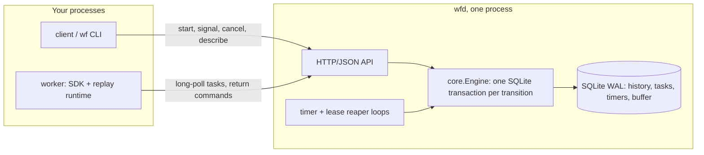

# workflow-engine: developer guide

## 1. What it is

workflow-engine is a small durable workflow engine in Go.
You write a workflow as ordinary Go code.
The server (`wfd`) stores every step as an event in SQLite.
Workers rebuild a workflow's state by replaying those events.
So a `kill -9` of the server or a worker loses nothing.

**Headline (measured, from `bench/results/*.json`):** 0 lost workflows and 0 double-applied side effects across 200 `kill -9`s (54 of them on the server) over 500 workflows.
With idempotency keys disabled, the same seed double-applied 22.
Throughput is 703 transitions/s with p99 81.7 ms, with the database on tmpfs.
On the Docker Desktop disk it drops to 10 transitions/s, because every commit waits for a real `fsync`.

`TestREADMEHeadline` fails if the README headline drifts from those JSON files.

## 2. Quickstart (5 minutes)

You need Docker and Git Bash. Go is not needed on the host; every Go command runs in `golang:1.26.8`.

```sh
cd workflow-engine
sh scripts/demo.sh            # wfd on host port 5400, 2 workers, 5 transfers, one worker is kill -9'd mid-flight
docker compose -f deploy/docker-compose.yml down -v   # tear down
```

The demo prints five receipts and the history of `demo-1`, which ends in `WorkflowExecutionCompleted`.

To see the chaos report yourself (about 2 minutes):

```sh
sh scripts/chaos.sh --workflows 100 --kills 50 --seed 1
```

It ends with `result PASS`.

## 3. Architecture



How one step works:

1. A worker long-polls `wfd` for a workflow task.
2. It receives the task and the run's full history.
3. It replays the history through a deterministic coroutine runtime and returns new commands.
4. `wfd` checks the commands against the history and appends events in one transaction.
5. Events that arrive while a task is in flight (signals, timers, activity results) are buffered and appended after it.

Activities run at least once. The SDK gives each one an idempotency key that is the same on every retry, so a side effect that honours the key happens once.
All writes go through one in-process FIFO queue in `store.WithTx`, then a `BEGIN IMMEDIATE` transaction with `synchronous=FULL`.
The exact guarantees, and what is not guaranteed, are in [semantics.md](semantics.md).

## 4. Project layout

| Path | What |
|---|---|
| `cmd/wfd` | the server |
| `cmd/wf` | CLI: start, describe, history, signal, cancel, result, health |
| `cmd/wfcheck`, `internal/wfcheck` | static linter for nondeterministic workflow code |
| `cmd/chaos`, `chaos/` | the kill -9 harness and its invariant checks |
| `cmd/wfbench`, `internal/bench` | the benchmark |
| `wire/` | public wire types: events, commands, payloads, API bodies |
| `internal/store` | SQLite schema, transactions, failpoints, consistency checker |
| `internal/core` | the engine: tasks, leases, timers, buffering, retries |
| `internal/api`, `internal/metrics` | HTTP API and Prometheus metrics |
| `internal/clock`, `internal/retry` | fake-able clock and retry backoff |
| `sdk/client`, `sdk/worker`, `sdk/workflow`, `sdk/activity` | the Go SDK |
| `sdk/internal/wfrt` | coroutine dispatcher and replay engine |
| `examples/transfer` | example workflow, idempotent ledger, `transfer-worker` |
| `deploy/docker-compose.yml` | the demo stack (compose project `workflow-engine`, port 5400) |
| `bench/results/` | measured chaos and benchmark JSON that the README cites |
| `scripts/` | Go-in-Docker wrappers and the demo, chaos, bench and gates scripts |
| `docs/adr/` | decision records |

## 5. Run, test and benchmark

All commands run from the repo root in Git Bash.

| Task | Command |
|---|---|
| Any `go` command | `sh scripts/go.sh <args>` (PowerShell: `scripts/go.ps1 <args>`) |
| A shell sequence in the Go image | `sh scripts/gosh.sh '<commands>'` |
| Unit and integration tests | `sh scripts/go.sh test -race -count=1 ./...` |
| Lint workflow code | `sh scripts/go.sh run ./cmd/wfcheck ./examples/... ./sdk/worker/...` |
| Every gate (fmt, vet, wfcheck, tests, short chaos, docker build) | `sh scripts/gates.sh` (ends with `GATES PASS`) |
| kill -9 soak test (30 workflows, 15 kills) | `sh scripts/gosh.sh 'WF_CHAOS=1 go test -race -count=1 -v -run TestKill9Soak ./chaos'` |
| Full chaos run | `sh scripts/chaos.sh --workflows 500 --kills 200 --seed 42 --out bench/results/chaos-latest.json` |
| Control run without idempotency keys | the same command with `--unsafe-ledger --out bench/results/chaos-control.json` |
| Benchmark on tmpfs | `sh scripts/bench.sh --out bench/results/bench-latest.json` |
| Benchmark on the container disk | `WF_TMPFS=0 sh scripts/bench.sh --workflows 150 --concurrency 16` |
| Docker image | `docker build -t workflow-engine:dev .` |

The scripts mount `/tmp` as tmpfs by default. Set `WF_TMPFS=0` to use the container disk.
Containers are named `workflow-engine-*`, and only host ports 5400-5409 are used.

## 6. Key decisions and what they gave up

| Decision | What it gave up |
|---|---|
| [0001](adr/0001-sqlite-single-node.md) One SQLite file, one server, FIFO write queue | No HA or horizontal scale; throughput bounded by `fsync`; reads wait behind writes |
| [0002](adr/0002-full-history-replay.md) Send the full history on every task | O(n) cost per task; capped at 50,000 events |
| [0003](adr/0003-at-least-once-activities.md) At-least-once activities plus idempotency keys | No per-attempt history; no heartbeat or schedule-to-close timeouts |
| [0004](adr/0004-buffer-events-during-inflight-task.md) Buffer events during an in-flight task | Signals and results wait for the task to finish |
| [0005](adr/0005-deterministic-dispatcher.md) Single-runner coroutine dispatcher | No parallelism in workflow code; `go`/`select` are caught only by `wfcheck` |
| [0006](adr/0006-process-level-chaos.md) Chaos kills processes, not containers; tmpfs by default | No network or disk faults; kill timing is not reproducible to the instruction |
| [0007](adr/0007-docker-only-toolchain-and-ports.md) Go only in Docker | Slower edit-test loop; IDE still needs a local Go |
| [0008](adr/0008-package-layout.md) Few server packages, public `wire` | No generic `wf replay`; single-argument signatures only |

## 7. Known limits and what's left

- One node and no replication. If `wfd` is down, nothing progresses; workers keep retrying.
- Every workflow task replays the full history. There is no sticky cache.
- No heartbeats, child workflows, continue-as-new, versioning or queries.
- The headline throughput is the tmpfs ceiling. On a slow disk, expect the `fsync` rate instead.
- CI (`.github/workflows/ci.yml`) is written but has not run on GitHub; the repo has no remote yet.
- `go install` paths in the README work only after the repo is pushed.
- v0.2: a Postgres store, sticky caches with incremental history, heartbeats and schedule-to-close timeouts.
